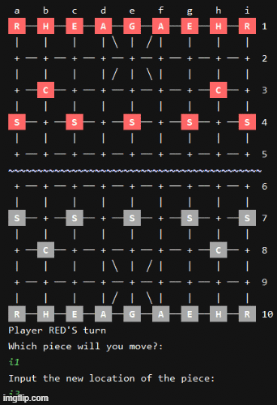

# Xiangi

The XiangqiGame program is a Python implementation of Xiangqi (https://en.wikipedia.org/wiki/Xiangqi), a strategical board game played between two players. The game is played similarly to Chess, where you have multiple game pieces with different movement patterns and the main goal of capturing the opponent's king/general. However, in Xiangqi, there are unique rules and game pieces such as the Cannon piece which must jump to capture enemy pieces. 

This program allows two players (Red vs. Black) to face each other in a round of Xiangqi. The locations on the game board are specified using algebraic notation with columns labeled a - i and rows labeled 1 - 10. Rows 1-5 are on the Red side and rows 6-10 are on the Black side. Red is the starting player and the game is over once a player wins the game by forcing the opponent's king/general into checkmate.

  

